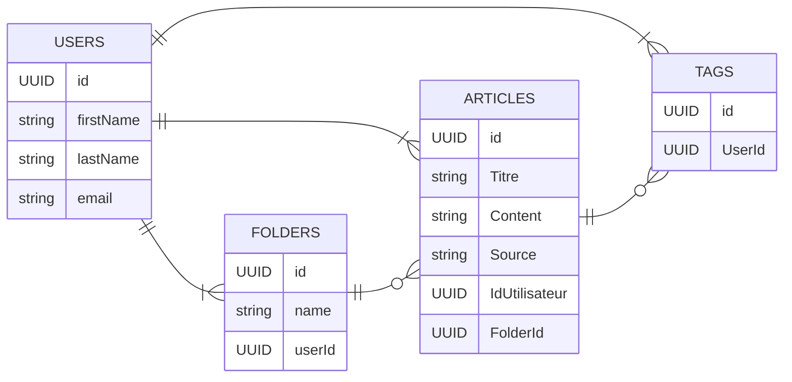

# Entities relationships

```mermaid
---
config:
  layout: dagre
  theme: mc
  look: classic
---
erDiagram
	direction LR
	USERS {
		UUID id  ""  
		string firstName  ""  
		string lastName  ""  
		string email  ""  
	}
	ARTICLES {
		UUID id  ""  
		string Titre  ""  
		string Content  ""
        string Source "" 
		UUID IdUtilisateur  ""  
		UUID FolderId  ""  
	}
	FOLDERS {
		UUID id  ""  
		string name  ""  
		UUID userId  ""  
	}
	TAGS {
		UUID id  ""  
		UUID UserId  ""  
	}
	USERS||--|{FOLDERS:"  "
	USERS||--|{TAGS:"  "
	USERS||--|{ARTICLES:"  "
	FOLDERS||--o{ARTICLES:"  "
	ARTICLES||--o{TAGS:" "
```
