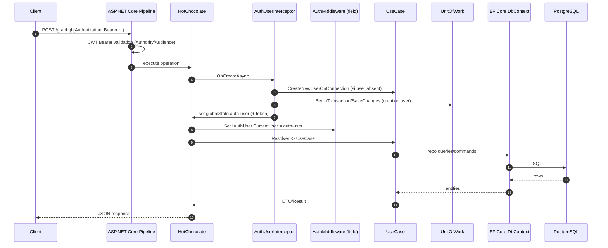

# Architecture

## Vue d'ensemble (Clean-ish Architecture)

Le code est organise en couches avec dependances "vers l'interieur":

- `Domain`: entites, value objects, exceptions de domaine, interfaces (ports) des repositories, interface d'auth (`IAuthUser`).
- `Application`: use cases, DTOs applicatifs, mapping (Mapperly), erreurs applicatives (FluentResults).
- `Infra`: implementations techniques (EF Core/Postgres, Auth0 userinfo fetch).
- `Presentation`: API GraphQL (HotChocolate), DI/composition root, middleware/interceptors, mapping des erreurs.

```mermaid
flowchart TB
  subgraph P[Presentation]
    GQL[Markivio.GraphQl\nGraphQL + DI + Middlewares]
  end
  subgraph A[Application]
    UC[UseCases\n(Article/Tag/User)]
    DTO[DTOs + Mappers]
  end
  subgraph D[Domain]
    ENT[Entities + VOs]
    PORTS[Ports\n(I*Repository, IAuthUser)]
    DEX[Domain Exceptions]
  end
  subgraph I[Infra]
    PERS[Persistence\nEF Core + Npgsql]
    AUTH[Auth\nAuthUser]
  end

  GQL --> UC
  UC --> PORTS
  UC --> ENT
  UC --> DEX
  PERS --> PORTS
  PERS --> ENT
  AUTH --> PORTS
  AUTH --> ENT
  GQL --> AUTH
  GQL --> PERS
```

### Projets .NET dans la solution

- `Presentation/Markivio.GraphQl`: l'API (point d'entree) et schema GraphQL.
- `Presentation/Markivio.Aspire`: AppHost Aspire pour le dev local (Postgres + API + frontend).
- `Application/Markivio.Application`: use cases + DTOs + Mapperly.
- `Domain/Markivio.Domain`: entites, value objects, exceptions, interfaces.
- `Infra/Markivio.Persistence`: EF Core context + configurations + repositories + migrations + UnitOfWork.
- `Infra/Markivio.Auth`: fetch userinfo a partir d'un JWT (cache + HTTP).
- `Pkg/Markivio.Extensions`: utilitaires (parse JWT, regex helper).
- `Tests/Markivio.UnitTests`: tests unitaires (xUnit v3 + Moq + Shouldly).

## Flux principal d'une requete GraphQL



## Donnees et multi-tenancy (isolation par utilisateur)

Le `DbContext` expose des `HasQueryFilter(...)` sur `Tag` et `Article` en fonction du `CurrentUserId` derive de `IAuthUser.CurrentUser.AuthId` (voir `Infra/Markivio.Persistence/Config/MarkivioContext.cs`).

Implication: il faut que `IAuthUser.CurrentUser` soit defini avant l'execution des resolvers EF (en pratique via l'interceptor + middleware GraphQL).

## Points d'attention (tech debt / risques)

- Connection string:
  - `Program.cs` lit `builder.Configuration.GetConnectionString("markivio")`.
  - `Presentation/Markivio.GraphQl/appsettings.json` definit `ConnectionStrings:DefaultConnection`.
  - En dehors d'Aspire, il faut fournir `ConnectionStrings__markivio` (ou aligner la cle) sinon l'API demarre avec une exception.
- Migrations au demarrage: `db.Database.MigrateAsync()` est appele au startup; pratique en dev, a encadrer en prod (permissions, temps de boot, verrous).
- Query filters EF:
  - `MarkivioContext` configure des filtres globaux.
  - `TagDbConfiguration` declare aussi un `HasQueryFilter(...)` different; selon EF, cela peut remplacer/combiner. A clarifier si l'intention est "AuthId" partout.

