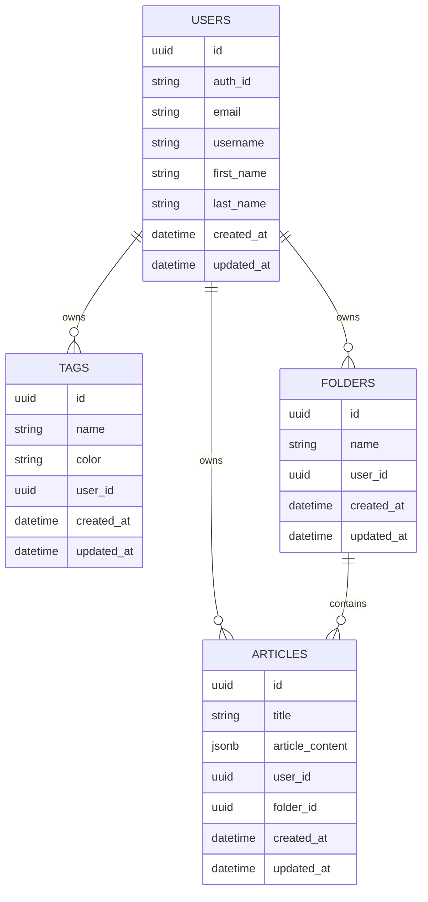

# Persistence (EF Core / PostgreSQL)

## DbContext

`Infra/Markivio.Persistence/Config/MarkivioContext.cs`:

- DbSets: `User`, `Article`, `Tag`, `Folder`
- Interceptor `DateTimeSaveUpdateIntercpetor`:
  - `CreatedAt` et `UpdatedAt` auto-set sur `Entity` lors de `SaveChanges`
- Configurations par entite via `IEntityTypeConfiguration`:
  - `ArticleDbConfiguration`, `TagDbConfiguration`, `UserDbConfiguration`, `FolderDbConfiguration`

## Migrations

Les migrations sont dans `Infra/Markivio.Persistence/Migrations`.

Important: l'API applique les migrations au demarrage (`db.Database.MigrateAsync()`).

## Model (high level)

Notes:

- `ArticleContent` est configure via `OwnsOne(...).ToJson()` et `OwnsMany(Tags)` dans le JSON.
- `TagValueObject` est mappe via `ComplexProperty` (name/color).
- `User` mappe `EmailValueObject` et `IdentityValueObject` via `ComplexProperty`.

## Repositories + Unit of Work

- Interfaces dans `Domain/Markivio.Domain/Repositories/*`
- Implementations dans `Infra/Markivio.Persistence/Repositories/*`
- `IUnitOfWork` fournit une transaction explicite (utilisee par middleware GraphQL + interceptor user creation).

## Multi-tenancy / data isolation

`MarkivioContext` applique des `HasQueryFilter` sur `Tag` et `Article` base sur l'utilisateur courant.

Cela suppose:

- `IAuthUser.CurrentUser` est defini avant que la requete n'atteigne EF Core.
- Les resolvers/mutations doivent passer par le pipeline GraphQL normal (interceptor + middleware).

